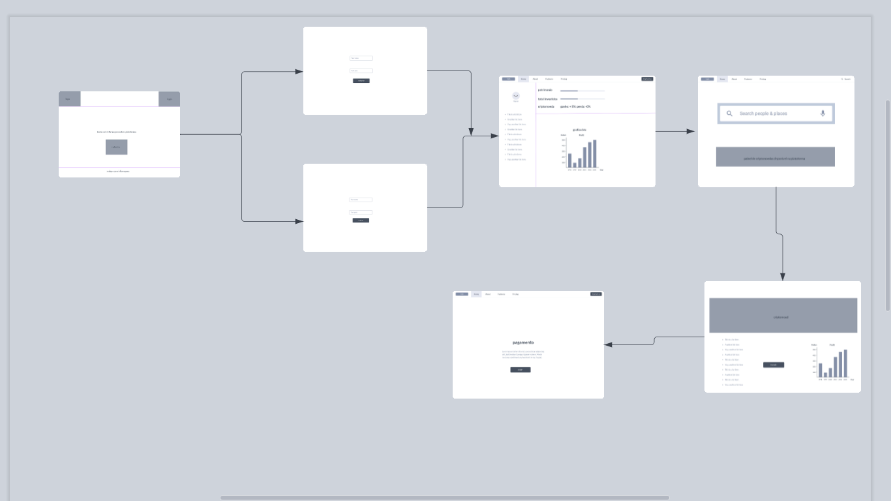
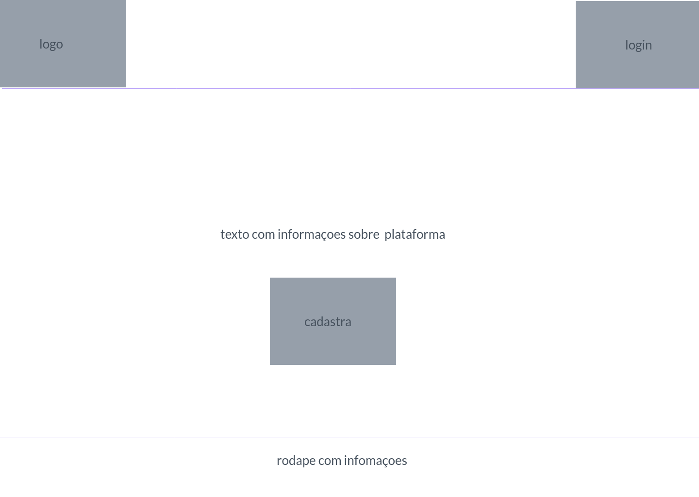
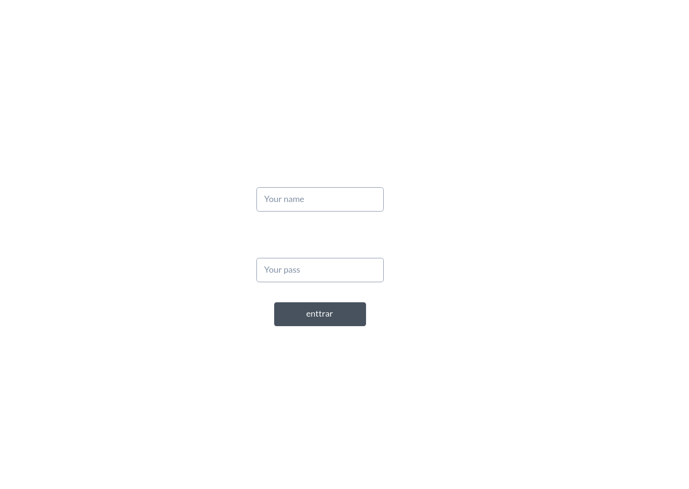
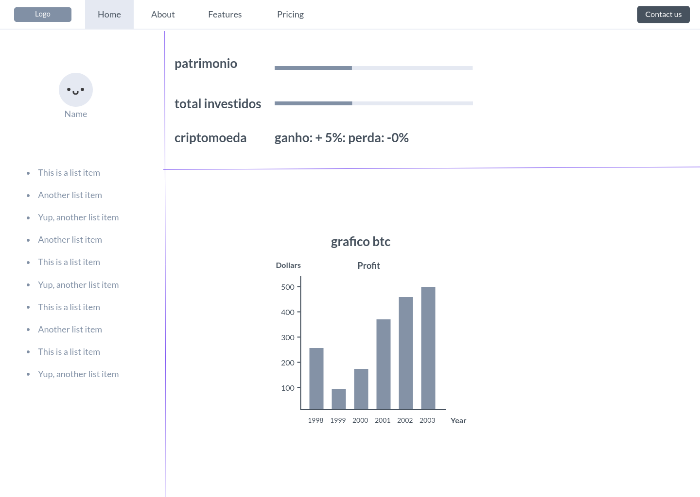
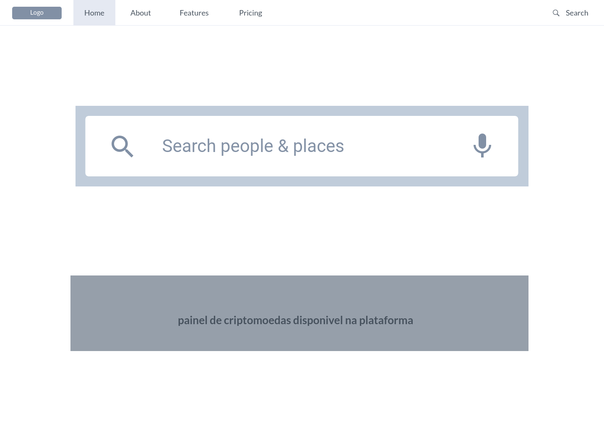
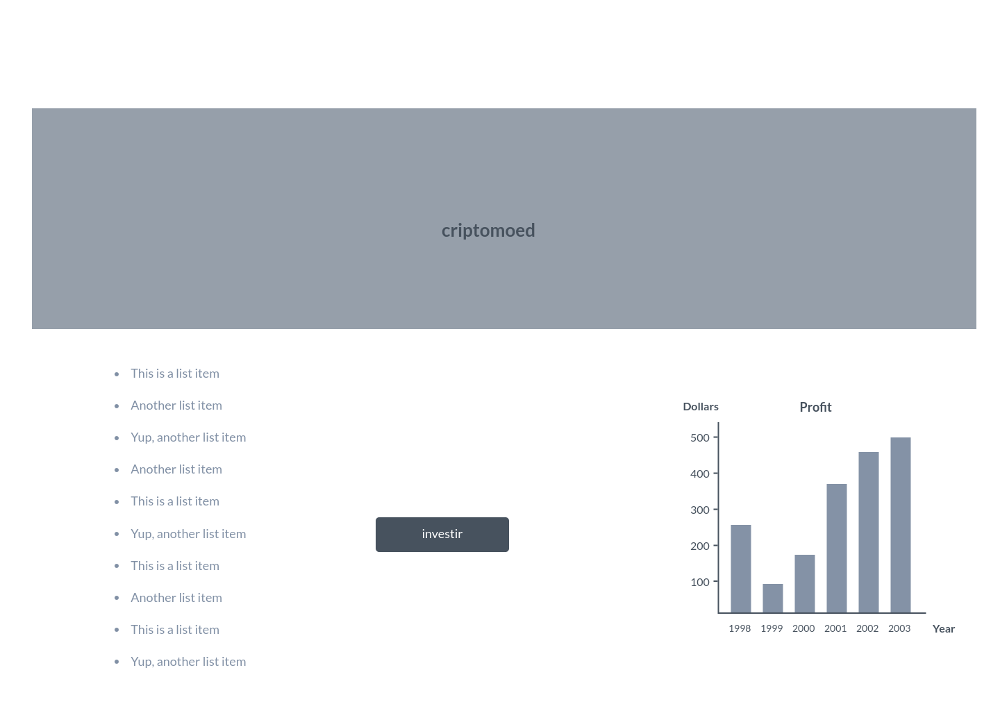
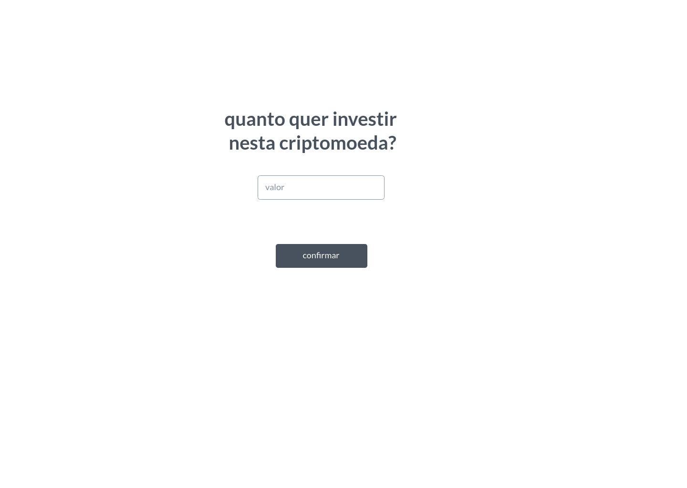
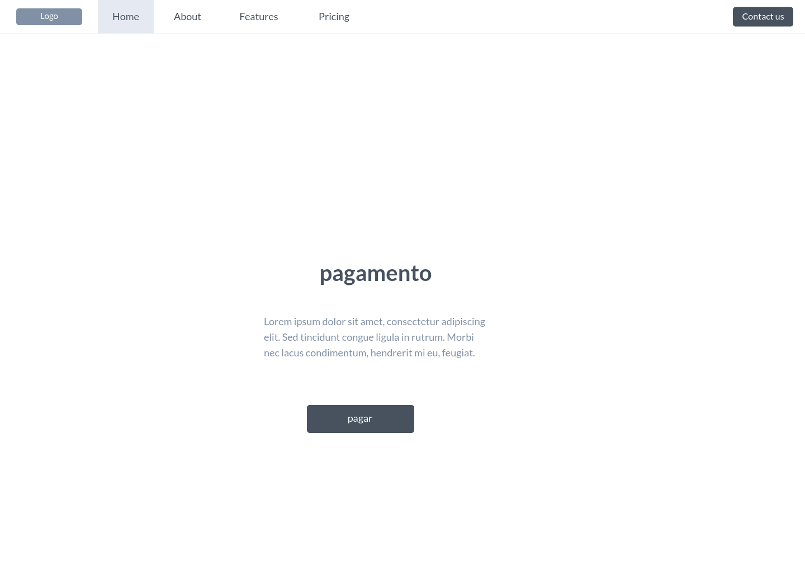

# Projeto de Interface

## Diagrama de Fluxo

## Wireframes

tela home

---

tela de cadastro

---

tela de login

---

tela de perfil.

---

tela de pesquisar com um painel abaixo com as criptos disponiveis na plataforma.

---

tela com as informaçoẽs da criptomoeda, mais um botão investir, mais o grafico.

---

tela para digitar o valor que quer investir.

---

tela pagamento.

---

 
> **Links Úteis**:
> - [Protótipos vs Wireframes](https://www.nngroup.com/videos/prototypes-vs-wireframes-ux-projects/)
> - [Ferramentas de Wireframes](https://rockcontent.com/blog/wireframes/)
> - [MarvelApp](https://marvelapp.com/developers/documentation/tutorials/)
> - [Figma](https://www.figma.com/)
> - [Adobe XD](https://www.adobe.com/br/products/xd.html#scroll)
> - [Axure](https://www.axure.com/edu) (Licença Educacional)
> - [InvisionApp](https://www.invisionapp.com/) (Licença Educacional)
